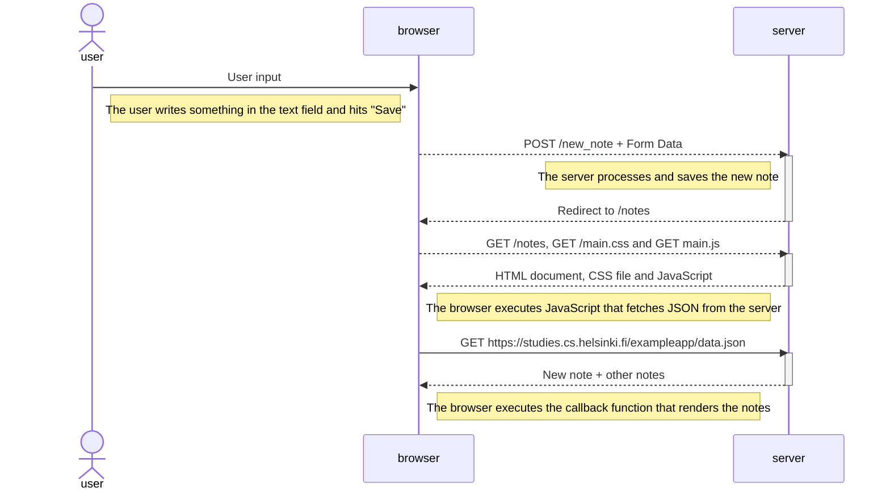

```mermaid
sequenceDiagram
    actor user
    participant browser
    participant server

    user->>browser: User input
    Note right of user: The user writes something in the text field and hits "Save"

    browser-->>server: POST /new_note + Form Data
    activate server

    Note left of server: The server processes and saves the new note

    server-->>browser: Redirect to /notes
    deactivate server

    browser-->>server: GET /notes, GET /main.css and GET main.js
    activate server
    server-->>browser: HTML document, CSS file and JavaScript
    deactivate server

    Note right of browser: The browser executes JavaScript that fetches JSON from the server

    browser->>server: GET https://studies.cs.helsinki.fi/exampleapp/data.json
    activate server
    server-->>browser: New note + other notes
    deactivate server

    Note right of browser: The browser executes the callback function that renders the notes
```
