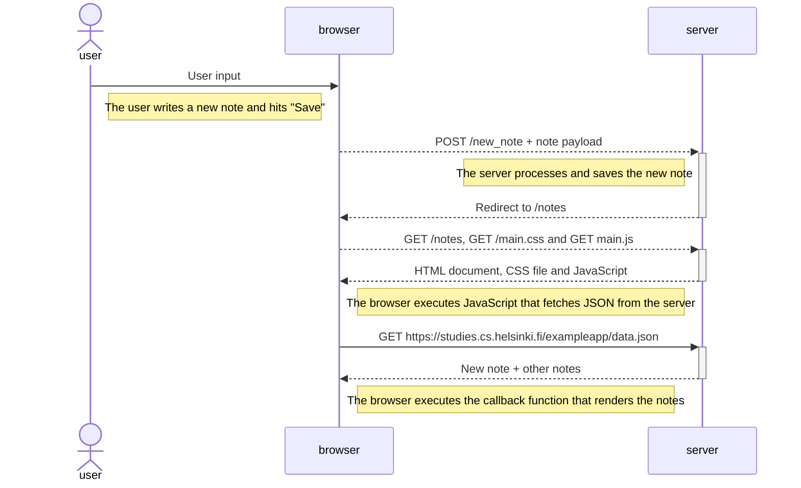

```mermaid
sequenceDiagram
    actor user
    participant browser
    participant server

    user->>browser: User input
    Note right of user: The user writes a new note and hits "Save"

    browser-->>+server: POST /new_note + note payload

    Note left of server: The server processes and saves the new note

    server-->>-browser: Redirect to /notes

    browser-->>+server: GET /notes, GET /main.css and GET main.js
    server-->>-browser: HTML document, CSS file and JavaScript

    Note right of browser: The browser executes JavaScript that fetches JSON from the server

    browser->>+server: GET https://studies.cs.helsinki.fi/exampleapp/data.json
    server-->>-browser: New note + other notes

    Note right of browser: The browser executes the callback function that renders the notes
```
