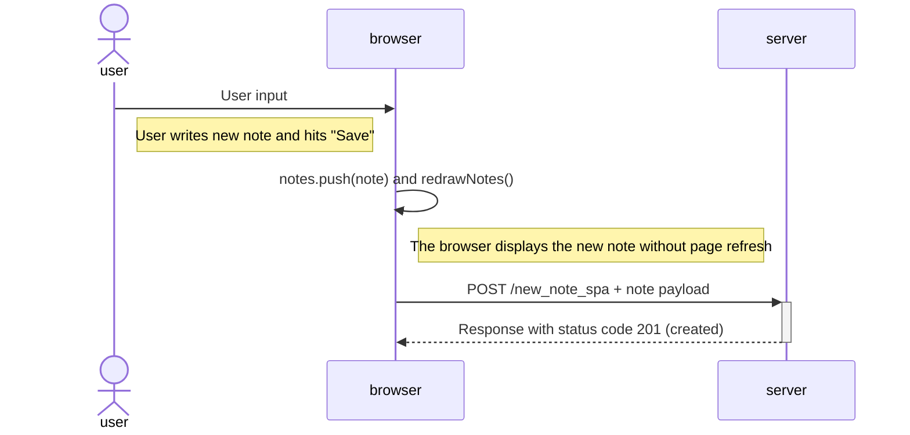

```mermaid
sequenceDiagram
    actor user
    participant browser
    participant server

    user->>browser: User input
    Note right of user: User writes new note and hits "Save"

    browser->>browser: notes.push(note) and redrawNotes()
    Note right of browser: The browser displays the new note without page refresh

    browser->>+server: POST /new_note_spa + note payload
    server-->>-browser: Response with status code 201 (created)
```
