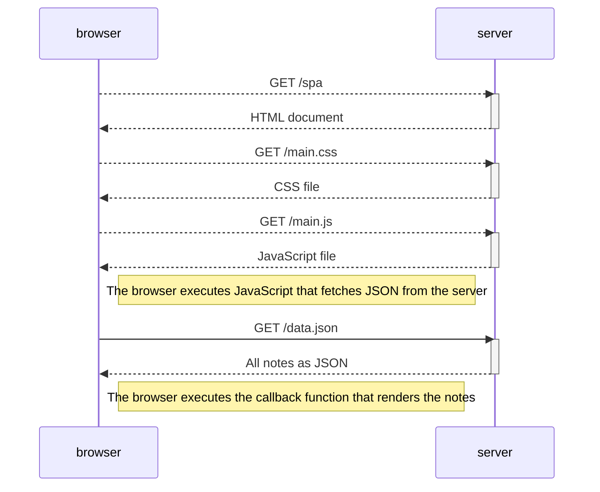

```mermaid
sequenceDiagram
    participant browser
    participant server

    browser-->>server: GET /spa
    activate server

    server-->>browser: HTML document
    deactivate server

    browser-->>server: GET /main.css
    activate server
    server-->>browser: CSS file
    deactivate server

    browser-->>server: GET /main.js
    activate server
    server-->>browser: JavaScript file
    deactivate server

    Note right of browser: The browser executes JavaScript that fetches JSON from the server

    browser->>server: GET /data.json
    activate server
    server-->>browser: All notes as JSON
    deactivate server

    Note right of browser: The browser executes the callback function that renders the notes
```
